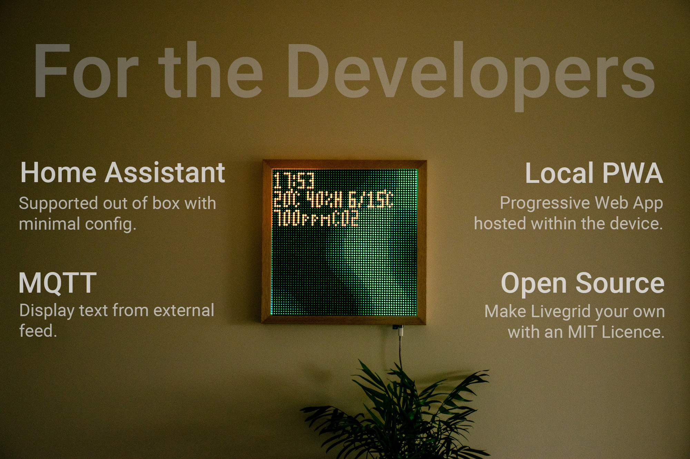

# Development

Livegrid is fully open source, and the code for the device is available on [GitHub](https://github.com/livegrid/OpenMatrix).

This is slightly different from the software running on your device, as it uses private versions of some libraries which I am not allowed to publish open-source. But besides a few branding features, the core logic is the same.

So make a fork and get started! And if you make any improvements, please do submit a pull request.
