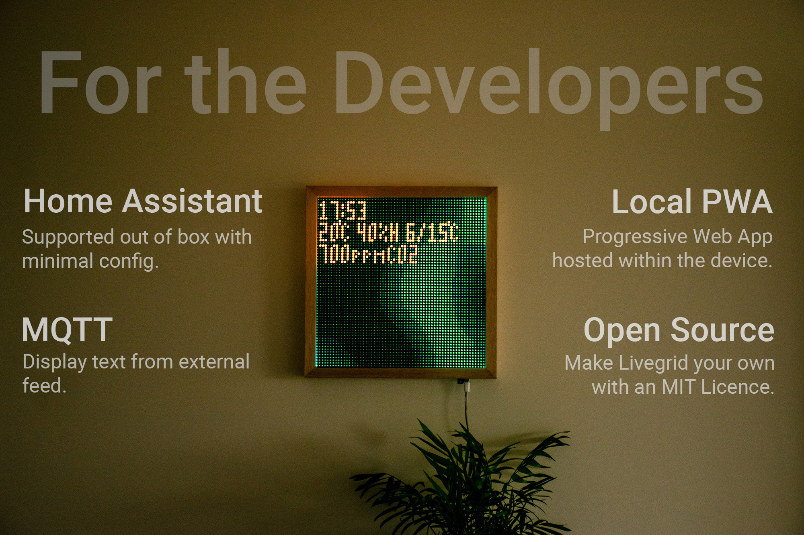

# Development



Livegrid is fully open source, and the code for the device is available on [GitHub](https://github.com/livegrid/OpenMatrix).

This is slightly different from the software running on your device, as it uses private versions of some libraries which I am not allowed to publish open-source. But besides a few branding features, the core logic is the same.

So make a fork and get started! And if you make any improvements, please do submit a pull request.

> Prerequisites: Comfortable with C++ (Arduino/ESP-IDF style), PlatformIO or the ESP32 toolchain, and basic Git workflow.

## Hardware & Schematics

Every Livegrid build is driven by open hardware. Schematics and PCB layouts are published so you can fabricate, inspect, or customize the boards that power your display.

- [Control Board · HUB75 Panels](https://oshwlab.com/dhruvkumars/livegrid_copy_copy_copy_copy): ESP32-S3 mainboard tuned for standard HUB75 LED matrices. Integrates the LED hub, USB‑C power input, and level shifting required to run 64×64 and 128×64 panels reliably.
- [Control Board · MBI5153 Upcycled Panels](https://oshwlab.com/dhruvkumars/livegrid_copy_copy_copy_copy_copy): Alternate mainboard that mates with recycled MBI5153-based modules while keeping the same ESP32S3 controller core. These are being used for the panels saved from landfill.
- [Sensor Extension Board](https://oshwlab.com/dhruvkumars/livegrid_copy_copy_copy_copy_copy_copy): Companion board that breaks out the environmental sensors, ambient light sensor, and 3 touch buttons. The idea is to bring the sensor outside to get clean readings and expose touch buttons.

Each project page above contains the schematic PDF, PCB layout views, and BOM exports. Feel free to fork the designs, panelize them for fabrication, or remix the routing for your own enclosures.

## Firmware Architecture

The firmware that ships on every Livegrid is derived from the community-maintained [`OpenMatrix`](https://github.com/livegrid/OpenMatrix) project. You can find all information in the repo if you would like to modify and build it for your application.

Only a handful of proprietary art assets differ between the public repository and the production firmware, so you can treat the open project as feature-complete.

## Development Environment

We recommend developing with [PlatformIO](https://platformio.org/) because it bundles the ESP32 toolchain and simplifies dependency management.

1. Install [VS Code](https://code.visualstudio.com/) and the PlatformIO extension.
2. Clone the repository:
   ```
   git clone https://github.com/livegrid/OpenMatrix.git
   cd OpenMatrix
   ```
3. Run `platformio run` once to let PlatformIO fetch frameworks and libraries.

If you prefer the Espressif toolchain manually, you can build with the Arduino CLI as long as you install the required frameworks at the specified versions in `platformio.ini`.

## Customize & Extend

- **Effects & Animations**: Fork the repository and explore `src/renderer`. Each effect implements `begin()`, `update()`, and `render()`, so you can clone an existing effect as a starting point.
- **Integrations**: Protocol bridges (MQTT, eDMX, UDP) live in `src/integrations`. Extend these handlers to add new transports or tweak buffering strategies.
- **Sensors & Telemetry**: Register additional sensors inside `src/sensors` and use the MQTT helpers to expose them to Home Assistant automatically.
- **Web UI**: The frontend under `webui/` can be rebuilt with `npm install && npm run build`, then flashed via `platformio run --target uploadfs`.

Check the `examples/` folder in the repository for reference sketches demonstrating pixel streaming and REST hooks, and share your findings back via pull requests or discussions.

## Further Reading

- [eDMX Protocols](edmx.md): Stream pixels from lighting desks or custom software, including the low-latency UDP mode.
- [MQTT & Home Assistant](mqtt.md): Automate the panel and surface sensor data in smart-home dashboards.
- [Web App Guide](webapp.md): Explore the on-device UI for configuration, scheduling, and diagnostics.
