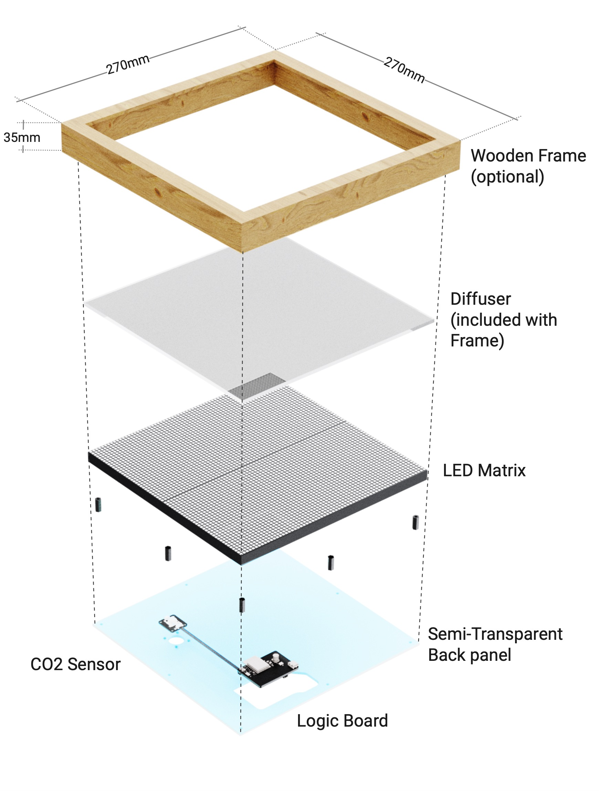

# Hardware

The Livegrid stack is intentionally modular so you can swap panels, sensors, and enclosures without reworking the entire device. The control electronics are published as open hardware; see the schematics and PCB notes inside the [development section](development.md#hardware-schematics).

> Prerequisites: Basic familiarity with ESP32 development boards and HUB75 LED panels makes it easier to follow along, but beginners can start with the quick checklist below.

## Technical Specifications

- **Controller**: ESP32-S3 dual-core MCU with integrated Wi-Fi and Bluetooth.
- **Displays**: HUB75 RGB matrices (64×64 default) or recycled MBI5153-based modules via the alternate control board.
- **Power**: 5 V DC input over USB‑C or header.
- **Sensors**: Temperature, humidity, CO₂ (SCD41/SCD40 class), and ambient light.
- **Expansion**: I²C breakout header, fan connector, and spare GPIO pads on the backplane.
- **Connectivity**: Wi-Fi 2.4 GHz, optional Ethernet via USB-C dongles supported in firmware.

## Assembly Highlights

1. Mount the control board directly to the panel using the supplied standoffs.
2. Connect the sensor/backplane board with the keyed ribbon cable.
3. Feed 5 V into the USB‑C port or JST power header; the regulator handles up to 5 A.
4. Route the touch buttons and speaker (if used) through the side headers.
5. Close the enclosure and run a smoke test with the built-in demo mode.

The exploded diagram above shows the default stack-up. For custom enclosures, export the DXF from the PCB projects to align mounting holes.

## Common Use Cases

- **Desk dashboards**: Mount the panel in a picture frame enclosure and power it from USB.
- **Wall-mounted sensors**: Run a thin USB-C cable through the wall and surface-mount the panel flush.
- **Installations**: Daisy-chain multiple panels with PoE injectors and sync content using the UDP streaming mode.

## Resources

- [Development Guide](development.md): Firmware architecture, build instructions, and PCB downloads.
- [eDMX](edmx.md): Control the panel from lighting consoles and media servers.
- [MQTT & Home Assistant](mqtt.md): Integrate with smart-home automations and dashboards.

